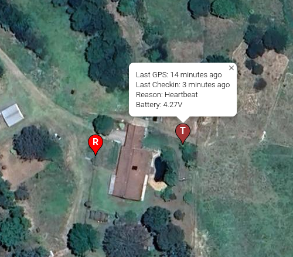
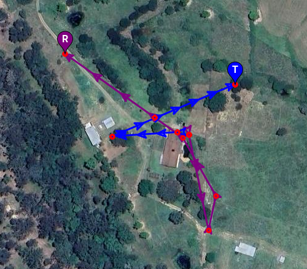
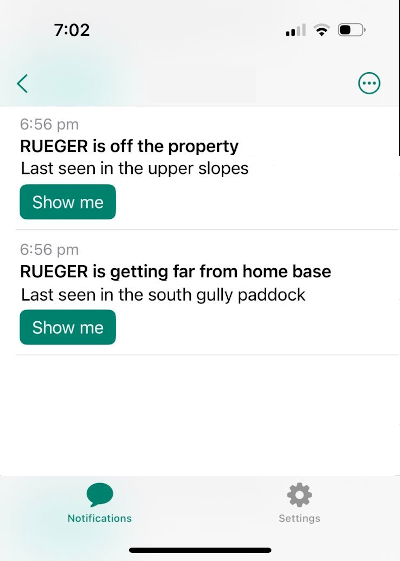

# Web app for Digital Matters Yabby3 tracking devices

This project provides an HTTP server that handles endpoints for the [Digital
Matters Yabby3](https://support.digitalmatter.com/en_US/yabby3-cellular) GPS
tracking devices. It also serves web pages of maps showing current tag
locations.

Demo at: https://tags.bitwombat.com.au/current

and

https://tags.bitwombat.com.au/paths

Notifications indicate when the tag has left boundaries or when the battery
is low.

## Theory of operation

A web service written in Go listens to endpoints.

The `/upload` endpoint is for GPS tracking devices to post their JSON payloads. The payload is
dumped as-is into a MongoDB database.

If the device location is outside the Safe Zone or Property boundaries, notifications are
sent (currently [ntfy.sh](https://ntfy.sh) is supported).

A boundary can be divided up into named zones for more useful notifications. See
screenshot below. These zones are defined in .kml files created with Google Earth.

When web users visit `/current` with a browser, a Google Map is returned with
markers showing current tag positions. The markers have other data about the
device, including data freshness and battery level.

When web users visit `/paths` with a browser, a Google Map is returned showing a
path of the last 50 received positions.

`/testnotify` is provided to trigger notifications for the purpose of testing
them.

## Installation and setup

1. You'll need a VPS and a Google Maps API key. The VPS needs to have MongoDB
   installed.
2. Notifications are currently supported using the incredibly easy
   [ntfy.sh](https://ntfy.sh). No signup or API key is required to use it. Just
   install the app on your phone and choose a random subscription name.
3. Customize environment variables in devops/dog-tracking.service
4. Set your VPS name in the deployment script in devops/deploy_and_run.sh
5. Delete the example zone and boundary files from `boundary_zones/` and `named_zones/`.
6. Generate .kml zone and boundary files using Google Earth and save those files
   individually to `boundary_zones/` and `named_zones/`.
7. Create an issue to bug the author to make the rest of the system configurable
   (see TODOs below)

## Deployment

From this dir, run

    $ devops/deploy_and_run.sh

## To run tests

    $ docker run --name some-mongo -d mongo:7.0
    $ go test ./...

## Backing up MongoDB

### Install mongodump

    wget https://fastdl.mongodb.org/tools/db/mongodb-database-tools-amazon2-x86_64-100.12.2.tgz
    tar zxvf mongodb-database-tools-amazon2-x86_64-100.12.2.tgz
    export PATH=/root/mongodb-database-tools-amazon2-x86_64-100.12.2/bin:$PATH

### Run mongodump

    mongodump

Results are in `./dump`

## Using MongoSH

    $ mongosh
    $ show dbs
    $ use tags
    $ show collections
    $ db.dogs.find()
    $ db.dogs.drop()

See https://www.mongodb.com/docs/mongodb-shell/crud/read/
https://www.mongodb.com/docs/manual/reference/method/

## Exporting Mongo

Follow instructions to install mongodb-database-tools from above, then:

    mongoexport --collection=dogs --db=tags  --type=json --jsonArray --out=dogs.json

## TODOs
- Make types that I unmarshal the Tx into match the types in the Yabby spec.
https://go.dev/ref/spec#Numeric_types

1. Make own location configurable (get it out of current-map.html).
2. Read boundaries from boundary_zones dir (get them out of main.go).
3. Put all boundaries and zones into two .kml files (just save the top folder in Google Earth).
4. Add instructions about how to make zones in Google Earth.
5. Improve instructions for setting up a server.
6. Make domain configurable with env vars (get it out of ntfy.go).
7. Make dog names and tag IDs controlled by env vars.
8. Make links in alerts go to dog location at that time.
9. Analyze battery usage.
10. If dog is out of range for long enough, don't report when he comes back
    (e.g. the collar hasn't checked in, and the next update is 28 hours later,
    and it reports "Dog X is now back close to the house".
11. Notify when the collar hasn't been heard from in X hours.
12. Notify when the collar hasn't GPS located in X hours.
13. Report furthest distance travelled.
14. Time window & slider for paths.
15. Setup "pragma optimize;" and "pragma vacuum;" to run daily on sqlite3.
